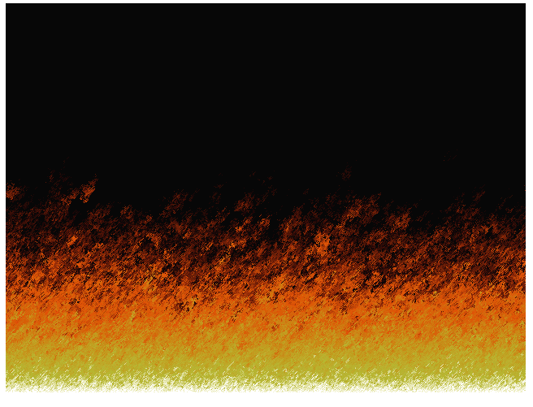

# wasm-fire
Experimenting with bare-metal wasm generation with C using ye-olde fire effects based off of PSX Doom's title screen ([reference](https://github.com/fabiensanglard/DoomFirePSX)).

Colors are obviously borked, but it still looks neat. Was inspired by watching tsoding's stream on his [bare metal rust wasm browser game](https://github.com/tsoding/rust-browser-game) and reading [these fantastic notes from Aransentin](https://aransentin.github.io/cwasm/). Fun stuff.
